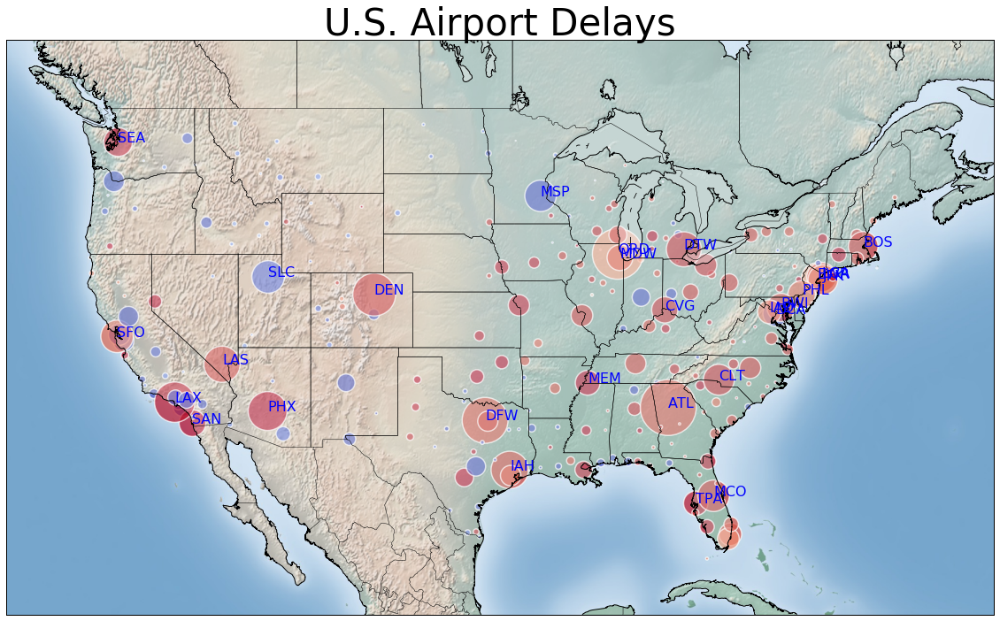

## Delayed-Flights

#### Overview
- This workbook will explore flight [`data`](http://stat-computing.org/dataexpo/2009/the-data.html) and predict delayed flights at airports located throughout United States based on previous flight records. The dataset consists of information such as flight arrival and departure times. Additionally, the .dat file for plotting the geographical location of airports in the U.S. can be found [`here`](https://github.com/jpatokal/openflights/blob/master/data/airports.dat). Python 2.7.11  and the Jupyter Ipython Notebook is utilized to explore, analyze, and visualize the results. This dataset examines flights from 2008, which is roughly 7 million flights! We will worki in the Apache Spark Ecosystem for general data processing and analysis. The `.csv` file containing the flight data and the airport attributes are imported as separate tables in a local PostgresSQL database for querying. 

<p align = "center">


</p>

#### Software and Libraries
- Python 2.7
- NumPy
- matplotlib.pyplot 
- iPython Notebook
- Basemap 1.0.7

#### Spark

- Apache Spark is an open source general engine for Big Data processing that is 100X faster than Hadoop MapReduce in memory or 10X faster when running on disk. It provides APIs in Python, Scala, R, and Java. The Spark Ecosystem consists of Spark SQL, Spark Streaming, MLib (machine learning), and GraphX. These libraries can be seamlessly combined in the same application. Spark can run on Hadoop, standalone, or in the cloud; it can also access data sources such as HDFS, Cassandra, and Hive. 

- To install Apache Spark, go ['here](http://spark.apache.org/downloads.html) and install the latest version (Spark 1.6.1)

- Open a terminal and cd into the home directory `(cd ~ )` 
- Unzip the .tgz file.
```tar -zxvf spark-1.6.1-bin-hadoop2.6.tgz```
- If unzipped in Downloads folder, move to home directory
```mv spark-1.6.1-bin-hadoop2.6 /Users/name```
- Next open `.bash_profile`
```nano .bash_profile```
- Add the following alias:
```
export SPARK_PATH=~/spark-1.6.1-bin-hadoop2.6
export PYSPARK_DRIVER_PYTHON = "jupyter"
export PYSPARK_DRIVER_PYTHON_OPTS = "notebook"
alias snotebook = '$SPARK_PATH/bin/pyspark --master local[2]'
```
- Save and exit .bash_profile; Update by:
```source .bash_profile```

- Note: --master local[2] is referenced to the number of processors that assigned 

#### Exploring the Data:

- The figure below displays the aiports with more than 70,000 flights recorded in the dataset in 2008. Airports with larger markers represent a higher magnitude of the total number of flights. Darker the marker fill, the higher the probabiity is for increased delayed times when departing from the respected airports. We can see from the geographical plot below that out of the queried airports in the United States, places like DFW, LAX, or ATL tend to have heavier delays and based on past experiences, our data is behaving as expected. As a note, viewing the code inside the `flights.ipynb` allows the user to zoom further, eliminating some of the overlap of airports observed belows, specifically on the East coast. 


